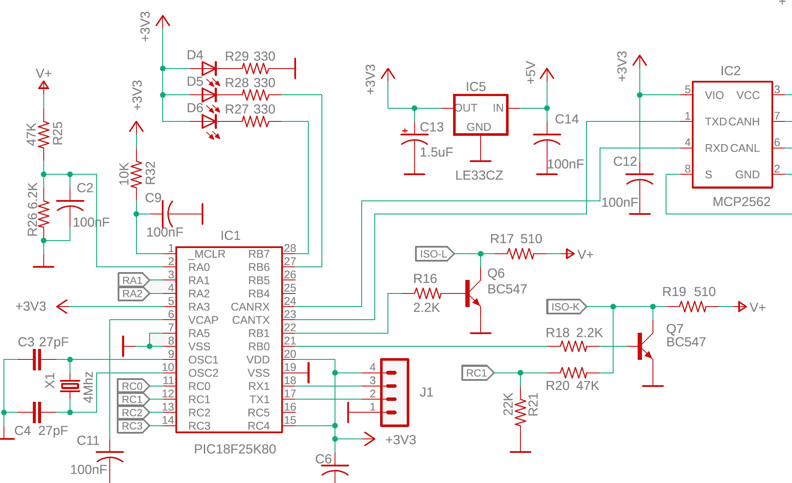
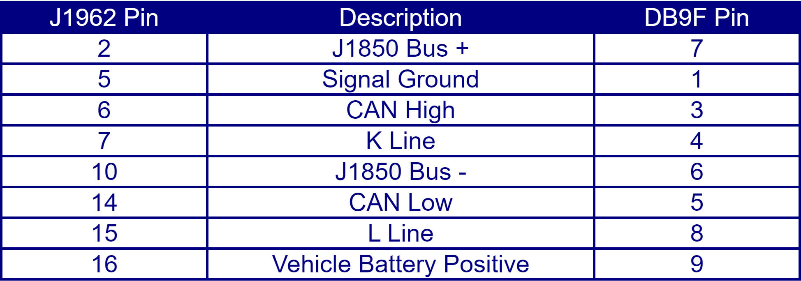
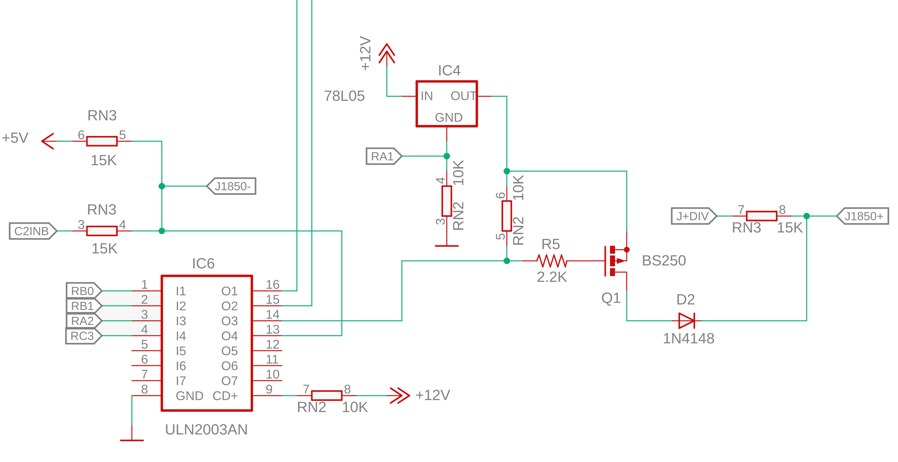

ELM327 adapter and firmware based on PIC18F25K80
==========================================

**You are always wanted to built ELM327 adapter but firmware was not available? Not anymore! Everything is here.**
 This was a side project done for testing ELM327 firmware available openly on GitHub. I just wanted to see if it works. And yes, it is pretty much functional! When the original ELM327 based on PIC18F2480, this one is built around PIC18F25K80 chip. From the schematic prospective it is almost the same, the only difference is VCAP/VDDCORE decoupling capacitor C11 on pin 6.

&nbsp;

J1850 voltage regulator is simplified based on the fact that the logical voltage level is 3.3V vs. 5V for PIC18F2480. The adapter uses 9-pin D type female connector to link up to vehicle's OBD-II J1962 connector. The pinout is De-facto a standard for OBD cables. The cable available on eBay or AliExpress from many vendors. The printed circuit board layout is in Eagle 9 format. 

&nbsp;

### Simplified schematic and improved firmware
One of many additional features of PIC18F25K80 is analog comparator. The previous schematic has comparator-like functionality with transistors Q4 and Q5. It can be replaced with PIC built-in analog comparator, see below. It should improve the reliability J1850 PWM signal handling. The firmware was modified as well to enable the internal comparator (the second in archive). Some unused pins turned to outputs, like RA3 and RC2. Using ULN2003 can reduce the number of external components. The Chinese knock-offs of ULN2003 are quite inexpensive. Another solution here to minimize number of components - using resistor arrays.

&nbsp;

